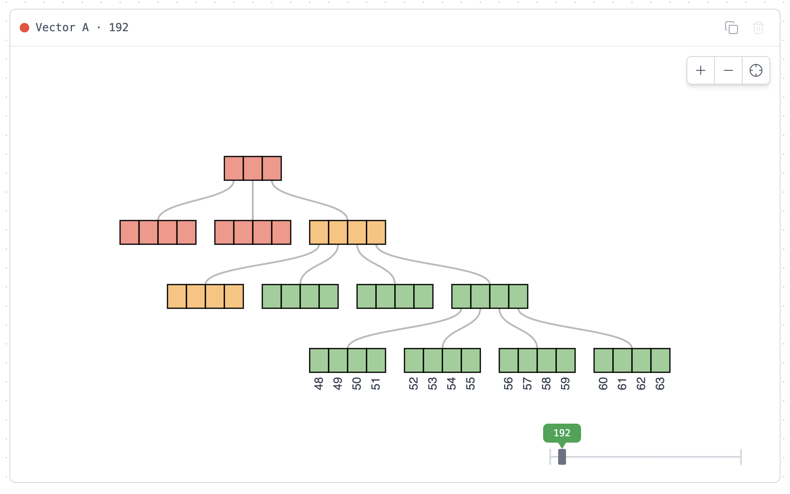
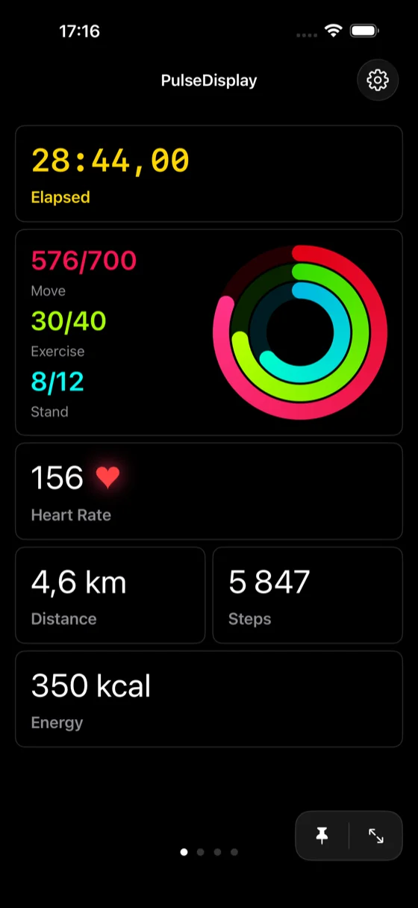
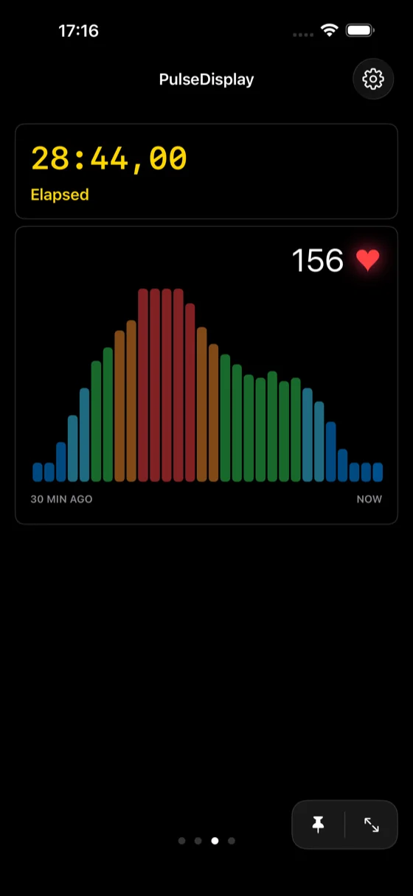
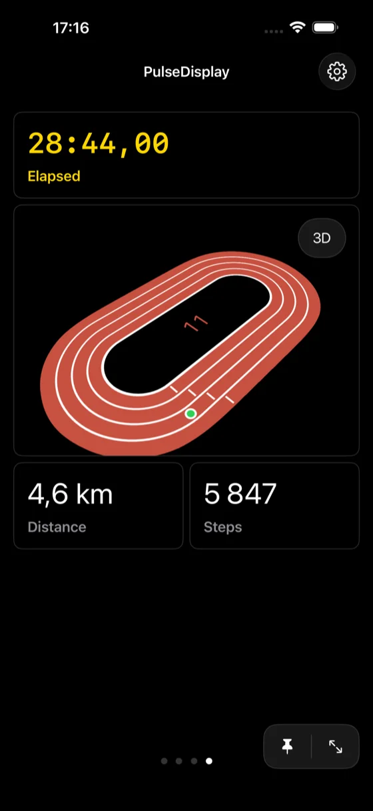

### Hi, I'm Araz

Software engineer in Oslo. Currently at Microsoft.

#### Projects

**[pvec-rs](https://github.com/ArazAbishov/pvec-rs)** — Persistent vector for Rust based on RRB trees

[Interactive visualization](https://pvec-rs.abishov.com/web-vis/) · [Thesis](https://abishov.com/thesis) · [Blog post](https://abishov.com/blog/pvec-rs-visualizing-structural-sharing/)

---

**[PulseDisplay](https://pulsedisplay.abishov.com)** — Real-time fitness dashboard that mirrors Apple Watch workout metrics to iPhone

  
  &nbsp;&nbsp;
  
  &nbsp;&nbsp;
  

---

#### Open-source contributions

- [microsoft/react-native-test-app](https://github.com/microsoft/react-native-test-app) — Helped design the Android integration
- [microsoft/beachball](https://github.com/microsoft/beachball) — Contributed semantic versioning features

#### Writing

I write occasionally at [abishov.com](https://abishov.com) about mobile development, Rust, and whatever else I'm tinkering with.

<!-- BLOG-POST-LIST:START -->
<!-- BLOG-POST-LIST:END -->
